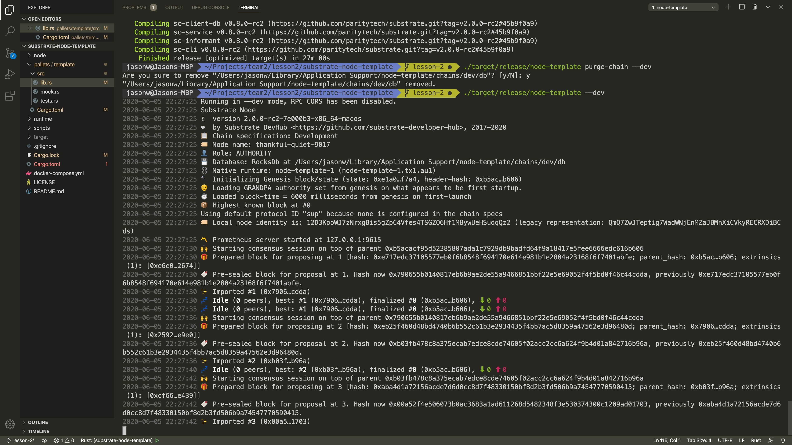
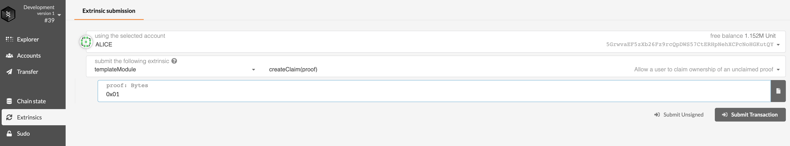
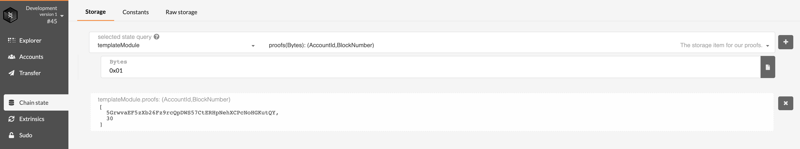
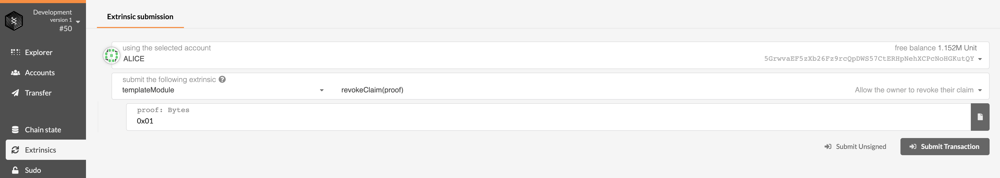
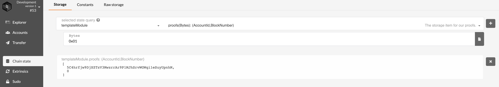
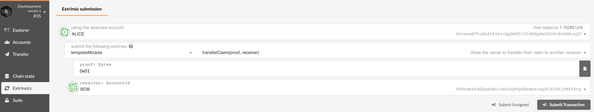
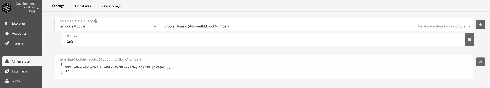

#### Question 1
- cargo build and node template run are successful

  

- create claim and state after claim created

  

  

- revoke claim and state after claim revoked

  

  

#### Question 2
- transfer claim and state after claim transferred

  

  

#### Question 3
**Implemented in pallets/template/src/lib.rs**