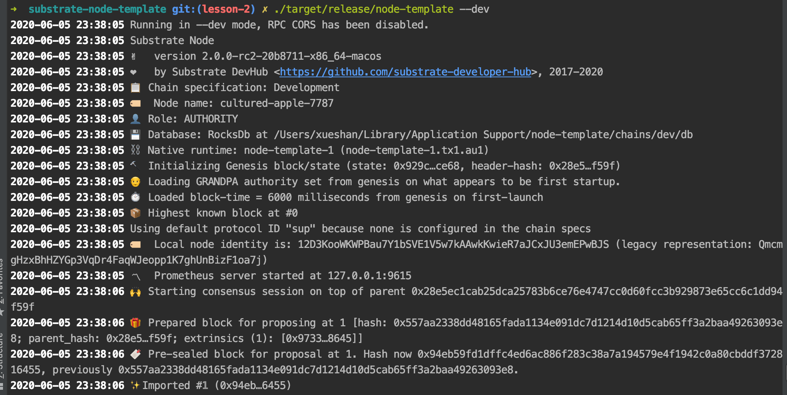
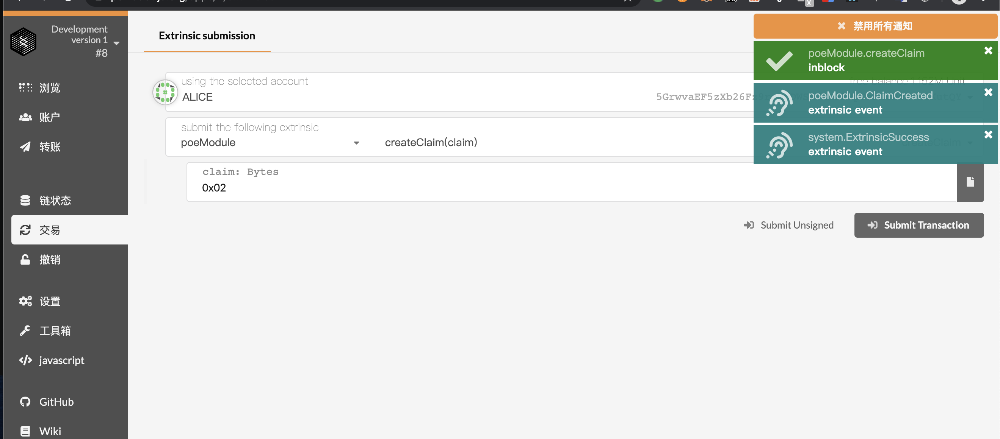
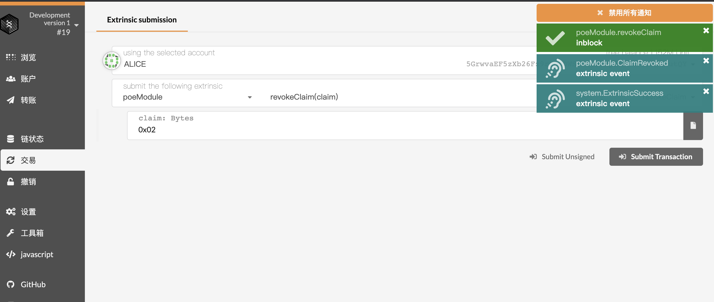
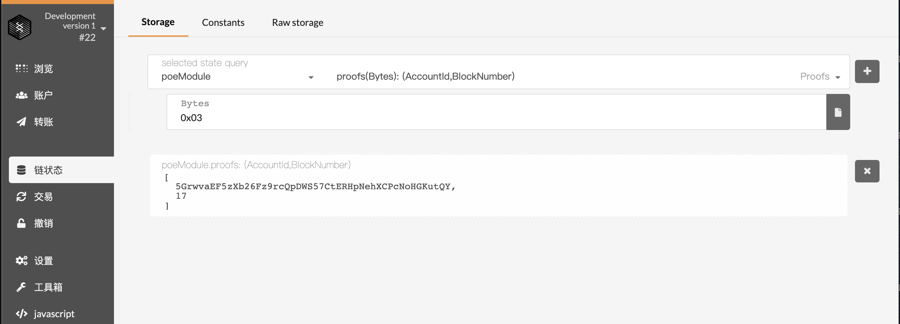
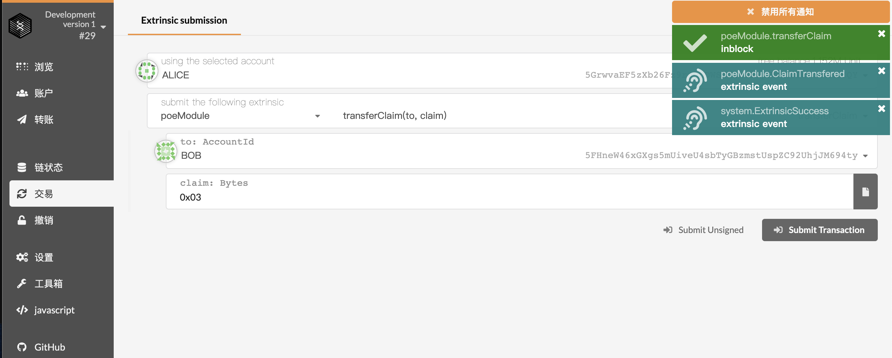
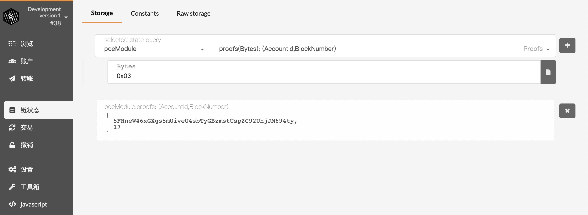
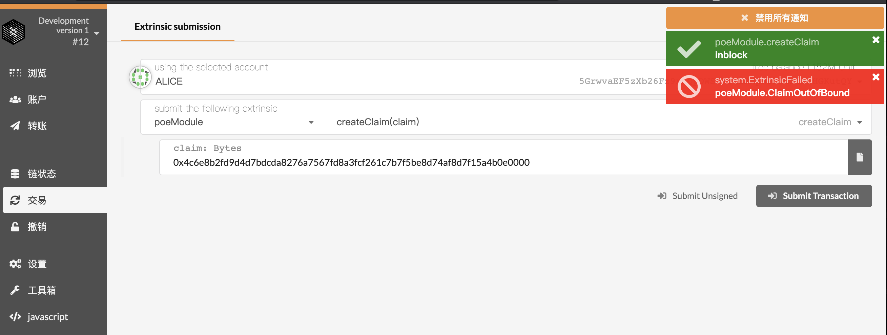

## 第二课作业 PoE 1

**程序运行的命令行截图：**

* 运行节点

  

**第一题：实现存证模块的功能，包括：**

* 创建存证，可调用函数所接收参数为内容的哈希值 Vec<u8>；

  

* 撤销存证，可调用函数所接收参数为内容的哈希值 Vec<u8>。

  

**第二题：为存证模块添加新的功能，**

* 转移存证，接收两个参数，一个是内容的哈希值，另一个是存证的接收账户地址；当存证不存在或者发送请求的用户不是存证内容的拥有人时，返回错误；当所有的检查通过后，更新对应的存证记录，并触发一个事件。

  1.转移前存证的拥有者Alice:

  

  2.转移存证给Bob:

  

  3.转移前存证的拥有者Bob:

  

**第三题（附加题）：**

* 创建存证时，为存证内容的哈希值设置界限，如果超出界限，返回错误。

  
